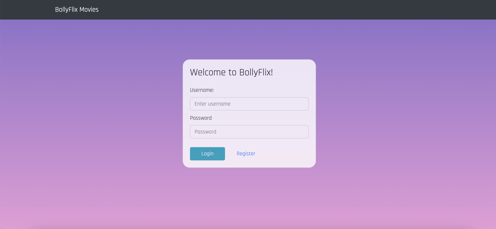
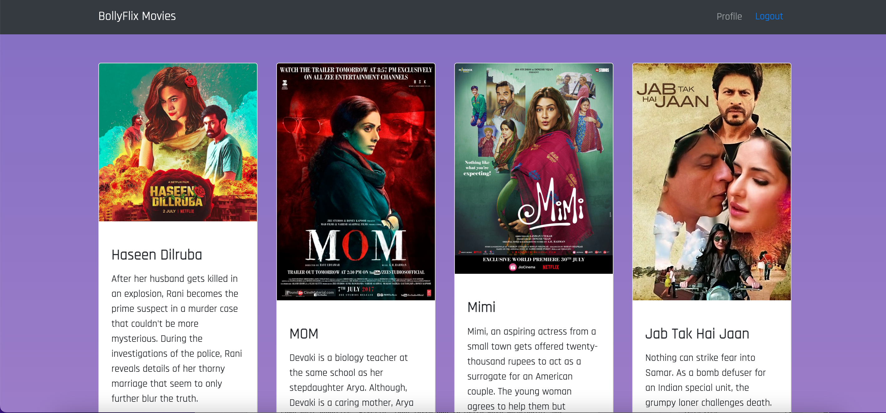

# Bollyflix Movie Client-Side

a client-side built with React and Redux for an app called Bollyflix Movies based on its existing server-side code (REST API and database).

<br>

## Installation

Install dependencies for bolly-flix-client with npm

```bash
  git clone https://github.com/LeezaJee/bolly-flix-client.git
  cd bolly-flix-client
  npm install
  
```

<br>

## Dependencies
**For Development**
- React
- React Bootstrap
- Redux
- Parcel 

<br>

## Features

a user can 
- create an account
- search for movies
- view movie details
- add and remove movies to/from a favorite list
- update and delete the user profile

<br>

## Screenshots




<br>

## Demo

The app is hosted on Netlify.
You can access it using [this]( https://bollyflix.netlify.app/) Project link.


